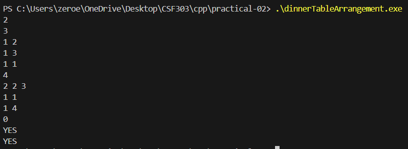
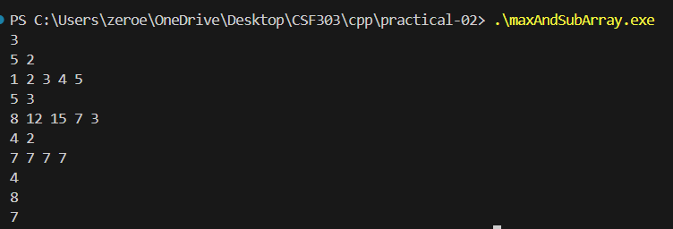
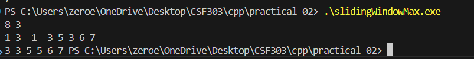
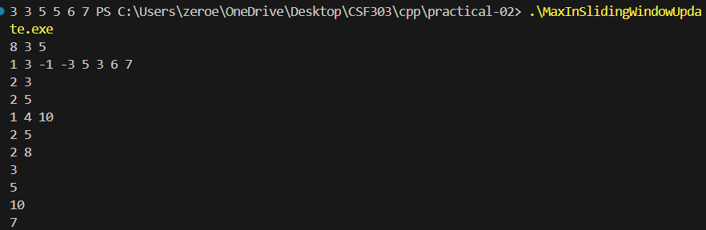
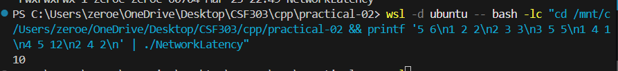
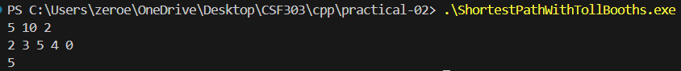

## Problem 1: Dinner Table Arrangements
**Problem**: Arrange N friends around a table so that no two adjacent share any common allergy. Allergies given as bitmask (1..30).  
**Approach**:  
- Build graph where edge exists if two friends have no common allergy.  
- We need a Hamiltonian cycle (since table is circular) that includes all friends.  
- Use bitmask DP: `dp[mask]` = bitmask of possible last vertices for a Hamiltonian path covering exactly the set `mask`.  
- Start from friend 0: `dp[1<<0] = 1<<0`.  
- For each mask, try each possible last vertex i (bits set in dp[mask]), and extend to neighbors j not in mask.  
- After processing all masks, check if `dp[(1<<N)-1]` contains a last vertex that is adjacent to start (friend 0).  
- Complexity: O(N²·2^N), feasible for N ≤ 20.  

**Key Code**:
```cpp
vector<int> dp(1<<N, 0);
dp[1<<0] = 1<<0;
for (int s = 0; s < (1<<N); s++) {
    int last = dp[s];
    for (int i = 0; i < N; i++) if (last & (1<<i)) {
        int cand = adj[i] & ~s;
        while (cand) {
            int j = __builtin_ctz(cand);
            cand &= cand-1;
            dp[s | (1<<j)] |= 1<<j;
        }
    }
}
if (dp[full] & adj[0]) cout << "YES\n";
```


---

## Problem 2: Maximum AND Subarray
**Problem**: Given array of N integers, find maximum possible AND value of any subarray of length exactly K.  
**Approach**:  
- Greedy bit‑by‑bit from MSB (30 down to 0).  
- Maintain candidate answer; for each bit, check if we can have candidate | (1<<bit) by sliding a window of size K where every element has all those bits set.  
- If yes, keep that bit.  
- Complexity: O(30·N) per test case.  

**Key Code**:
```cpp
int ans = 0;
for (int bit = 30; bit >= 0; bit--) {
    int cand = ans | (1 << bit);
    int cnt = 0;
    bool ok = false;
    for (int x : arr) {
        if ((x & cand) == cand) {
            if (++cnt == K) { ok = true; break; }
        } else cnt = 0;
    }
    if (ok) ans = cand;
}
cout << ans << "\n";
```


---

## Problem 3: Sliding Window Maximum
**Problem**: Output maximum of every subarray of size K.  
**Approach**:  
- Use deque to store indices of candidates in decreasing order of value.  
- For each i:  
  - Remove from back while arr[back] ≤ arr[i] (monotonic decreasing).  
  - Push i to back.  
  - Remove front if it’s out of window (index ≤ i-K).  
  - When i ≥ K-1, output arr[front].  
- Complexity: O(N).  

**Key Code**:
```cpp
deque<int> dq;
for (int i = 0; i < N; i++) {
    while (!dq.empty() && arr[dq.back()] <= arr[i]) dq.pop_back();
    dq.push_back(i);
    if (dq.front() <= i - K) dq.pop_front();
    if (i >= K - 1) cout << arr[dq.front()] << " ";
}
```


---

## Problem 4: Maximum in Sliding Window with Updates
**Problem**: Process two types of queries:  
- Type 1: update A[pos] = val  
- Type 2: query max in window of size K ending at index i.  
**Approach**:  
- Use segment tree for range maximum queries.  
- Build tree from initial array.  
- Update: point update O(log N).  
- Query: get max in range [max(0, i-K+1), i] O(log N).  
- Complexity: O((N+Q) log N).  

**Key Code** (segment tree implemented as power‑of‑two size):
```cpp
class SegTree {
    int size;
    vector<int> tree;
public:
    SegTree(vector<int>& data) {
        size = 1;
        while (size < data.size()) size <<= 1;
        tree.assign(2*size, 0);
        for (int i = 0; i < data.size(); i++) tree[size+i] = data[i];
        for (int i = size-1; i > 0; i--) tree[i] = max(tree[2*i], tree[2*i+1]);
    }
    void update(int pos, int val) {
        int i = size + pos;
        tree[i] = val;
        for (i /= 2; i; i /= 2) tree[i] = max(tree[2*i], tree[2*i+1]);
    }
    int query(int l, int r) { // inclusive
        l += size; r += size;
        int res = -1e9;
        while (l <= r) {
            if (l & 1) { res = max(res, tree[l]); l++; }
            if (!(r & 1)) { res = max(res, tree[r]); r--; }
            l /= 2; r /= 2;
        }
        return res;
    }
};
```


---

## Problem 5: Network Latency
**Problem**: Find shortest path from node 1 to node N in an undirected weighted graph.  
**Approach**:  
- Standard Dijkstra’s algorithm with priority queue.  
- Complexity: O((N+M) log N).  

**Key Code**:
```cpp
vector<ll> dist(N, INF);
dist[0] = 0;
priority_queue<pair<ll,int>, vector<...>, greater<...>> pq;
pq.emplace(0, 0);
while (!pq.empty()) {
    auto [d, u] = pq.top(); pq.pop();
    if (d != dist[u]) continue;
    for (auto [v, w] : adj[u]) {
        if (dist[v] > d + w) {
            dist[v] = d + w;
            pq.emplace(dist[v], v);
        }
    }
}
cout << (dist[N-1] == INF ? -1 : dist[N-1]) << "\n";
```


---

## Problem 6: Shortest Path with Toll Booths
**Problem**: N toll booths in a line. Start at booth 1 with M coins. At each booth i (1..N-1), you may:  
- Pay toll[i] coins and proceed (cost 1 minute)  
- Skip the booth (cost 2 minutes), but at most K skips total.  
Find min time to reach booth N, or -1 if impossible.  
**Approach**:  
- Greedy: to minimise time, we want to pay as many booths as possible (since paying costs 1 min vs skipping costs 2 min).  
- Pay cheapest tolls first, using up to M coins.  
- Let paid = number of booths we can pay, skips = (N-1) - paid.  
- If skips ≤ K, total time = (N-1) + skips (because paid booths cost 1 min each, skipped cost 2 min each, but base time is N-1 minutes if all paid, and each skip adds 1 extra minute).  
- Otherwise impossible.  
- Complexity: O(N log N) for sorting.  

**Key Code**:
```cpp
vector<int> booths(toll.begin(), toll.end() - 1);
sort(booths.begin(), booths.end());
long long total = 0;
int paid = 0;
for (int t : booths) {
    if (total + t <= M) {
        total += t;
        paid++;
    } else break;
}
int skips = (N-1) - paid;
if (skips <= K) cout << (N-1) + skips << "\n";
else cout << "-1\n";
```

