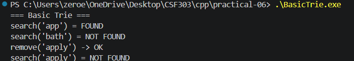
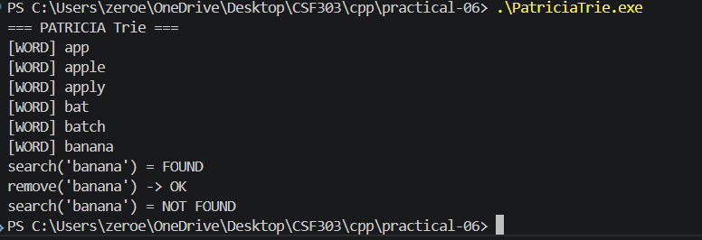
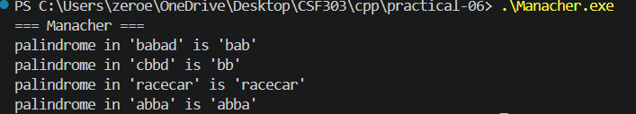

# Reflection on Implementation

## Overview
This submission includes independent module implementations for:
- `BasicTrie.h` and `BasicTrie.cpp`
- `PatriciaTrie.h` and `PatriciaTrie.cpp`
- `Manacher.h` and `Manacher.cpp`

Each component also has its own standalone demo program:
- `BasicTrie.cpp` → `BasicTrie.exe`
- `PatriciaTrie.cpp` → `PatriciaTrie.exe`
- `Manacher.cpp` → `Manacher.exe`

## Basic Trie
- Implemented a standard lowercase English Trie using fixed-size arrays for child pointers.
- Supported `insert`, `search`, and `remove` operations.
- `remove` recursively deletes nodes only when they are no longer part of another inserted word.
- Demonstrated independently via `BasicTrie.cpp`.

## PATRICIA Trie
- Implemented a compressed trie that stores whole edge labels instead of single characters.
- `insert` handles edge splitting when the new word shares a partial prefix with an existing edge.
- `search` walks the compressed edges and verifies every edge label matches the corresponding substring.
- `remove` recursively deletes words and collapses nodes when a parent has a single child and is not a word ending.
- Demonstrated independently via `PatriciaTrie.cpp`.

## Manacher's Algorithm
- Implemented the classic O(n) longest palindromic substring algorithm.
- Transformed the string with separator characters to unify odd/even palindrome handling.
- Computed the palindrome radius array and extracted the longest palindrome.
- Demonstrated independently via `Manacher.cpp`.

